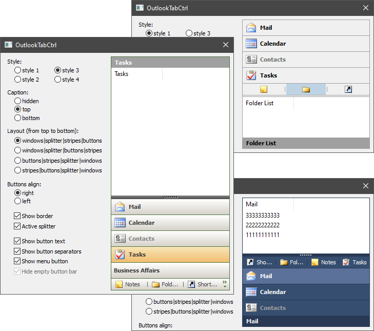

# OutlookTabCtrl



## Introduction

This control is another kind of tabs. Tabs are displayed as horizontal stripes and can be collapsed into buttons located in a separate area. Each tab is assigned its own window, which is shown when you click on the tab. An additional button can be displayed in the button area. You can use it to show menu, for example.

The control is derived from `CWnd` and is a common control based on MFC. It is possible to put it on any window: main frame, dialog, etc.

## Using the Code

To create the control and add elements to it, you can do the next steps:

```cpp
#include "OutlookTabCtrl.h"

OutlookTabCtrlEx<OutlookTabCtrlCustom1> m_TabCtrl;
CListCtrl m_List1, m_List2;

...

if( !m_TabCtrl.Create(this, WS_CHILD | WS_VISIBLE,CRect(10,10,100,200), ID_OutlookTabCtrl) )
    return -1;    // error.

// Create an ImageList with icons for tabs displayed as stripes.
m_TabCtrl.CreateStripeImage(NULL,IDB_STRIPE_NORMAL,IDB_STRIPE_DISABLE,true,24);
// Create an ImageList with icons for tabs displayed as buttons.
m_TabCtrl.CreateButtonImage(NULL,IDB_BUTTON_NORMAL,IDB_BUTTON_DISABLE,true,16);

// Create child controls.
if( !m_List1.Create(WS_CHILD | WS_CLIPCHILDREN | LVS_REPORT, CRect(0,0,0,0), &m_TabCtrl,ID_List1) ||
    !m_List2.Create(WS_CHILD | WS_CLIPCHILDREN | LVS_REPORT, CRect(0,0,0,0), &m_TabCtrl,ID_List2) )
    return -1;    // error.
m_List1.InsertColumn(0,"Mail",LVCFMT_LEFT,100);
m_List2.InsertColumn(0,"Calendar",LVCFMT_LEFT,100);

// Add child items in the m_TabCtrl.
if( !m_TabCtrl.AddItem(&m_List1,"Mail",0,0) ||
    !m_TabCtrl.AddItem(&m_List2,"Calendar",1,1) )
    return -1;    // error.

// Load state from registry.
if( !m_TabCtrl.LoadState(AfxGetApp(),"OutlookTabCtrl","State") )
    m_TabCtrl.PushVisibleItem();    // create default state.

m_TabCtrl.Update();
````

The `OutlookTabCtrl` class does not draw itself. To do this, inherit from the `OutlookTabCtrl::Draw` class and implement its functions. A pointer to `OutlookTabCtrl::Draw` must be passed to the control by calling the `SetDrawManager` function. The classes `OutlookTabCtrlCustom1`, `OutlookTabCtrlCustom2`, `OutlookTabCtrlCustom3`, `OutlookTabCtrlCustom4` are ready-made implementations of the `OutlookTabCtrl::Draw` class. Each of them renders `OutlookTabCtrl` in its own style. The `OutlookTabCtrlEx` class helps you combine `OutlookTabCtrl` with the render class. For example, like this: `OutlookTabCtrlEx<OutlookTabCtrlCustom2> ctrl;` .

The `OutlookTabCtrl::IRecalc` interface sets the sizes of the areas in the control. The `OutlookTabCtrl` class has its own `OutlookTabCtrl::IRecalc` implementation. But you can also make your own implementation of the `OutlookTabCtrl::IRecalc` interface and pass a pointer to it in the control using the `SetRecalcManager` function.

There are also three additional classes: `Ability`, `Notify`, and `ToolTip`. The `Ability` class allows the user to select any tab. `Notify` informs about the occurrence of some event. `ToolTip` manages the creation of tooltips for tabs in button state. A pointer to the implementation of each of the classes must also be passed to `OutlookTabCtrl`.

Windows for all new added items should have the unique identifiers. Items can be in the state of a stripe or button. By default, an item is added as a stripe. The user should call the `Update` function to show the results that are set by functions `DeleteItem`, `SetItemWindow`, `SelectItem`, etc. You can hide an item (`ShowItem`) or block it (`DisableItem`). It is also possible to get the index of an item among all visible items (`GetVisibleIndexByHandle`) or in general among all items in the control (`GetIndexByHandle`). A control can save and load the position of its elements and their visibility from the registry or another source (`LoadState`/`SaveState`). This is only part of the possibilities. To learn more, take a look at the public interface of the `OutlookTabCtrl` class.

Good luck! :-)
